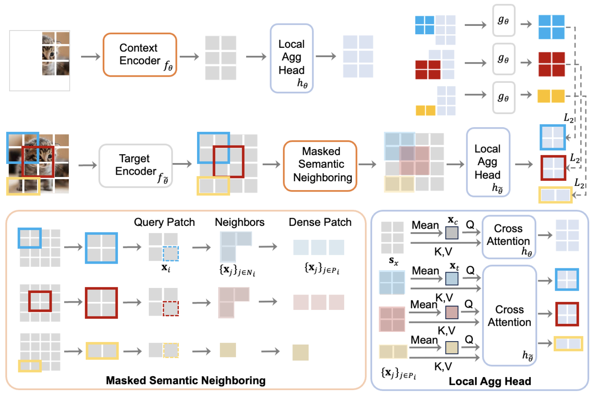

# DMT-JEPA

Official codebase for DMT-JEPA (**DMT-JEPA: Discriminative Masked Targets for Joint-Embedding Predictive Architecture**)

## Method

DMT-JEPA is a novel masked modeling framework rooted in JEPA, specifically designed to generate discriminative latent targets from neighboring information. Our key idea is simple: we consider a set of semantically similar neighboring patches as a target of a masked patch.


<div align="center">
  
</div>


## Code Structure

```
.
├── configs                   # directory in which all experiment '.yaml' configs are stored
├── src                       # the package
│   ├── train.py              #   the DMT-JEPA training loop
│   ├── helper.py             #   helper functions for init of models & opt/loading checkpoint
│   ├── transforms.py         #   pre-train data transforms
│   ├── datasets              #   datasets, data loaders, ...
│   ├── models                #   model definitions
│   ├── masks                 #   mask collators, masking utilities, ...
│   └── utils                 #   shared utilities
├── main_distributed.py       # entrypoint for launch distributed DMT-JEPA pretraining on SLURM cluster
└── main.py                   # entrypoint for launch DMT-JEPA pretraining locally on your machine
```

**Config files:**
Note that all experiment parameters are specified in config files (as opposed to command-line-arguments). See the [configs/](configs/) directory for example config files.

## Launching DMT-JEPA pretraining

### Single-GPU training
This implementation starts from the [main.py](main.py), which parses the experiment config file and runs the pre-training locally on a multi-GPU (or single-GPU) machine. For example, to run DMT-JEPA pretraining on GPUs "0","1", and "2" on a local machine using the config [configs/in1k_vith14_ep300.yaml](configs/in1k_vith14_ep300.yaml), type the command:
```
python main.py \
  --fname configs/in1k_vith14_ep300.yaml \
  --devices cuda:0 cuda:1 cuda:2
```
*Note: This example is just used for illustrative purposes, as the ViT-H/14 config should be run on 16 A100 80G GPUs for an effective batch-size of 2048, in order to reproduce our results.*

### Multi-GPU training
In the multi-GPU setting, the implementation starts from [main_distributed.py](main_distributed.py), which, in addition to parsing the config file, also allows for specifying details about distributed training. For distributed training, we use the popular open-source [submitit](https://github.com/facebookincubator/submitit) tool and provide examples for a SLURM cluster.

For example, to pre-train on 16 A100 80G GPUs using the pre-training experiment configs specificed inside [configs/in1k_vith14_ep300.yaml](configs/in1k_vith14_ep300.yaml), type the command:
```
python main_distributed.py \
  --fname configs/in1k_vith14_ep300.yaml \
  --folder $path_to_save_submitit_logs \
  --partition $slurm_partition \
  --nodes 2 --tasks-per-node 8 \
  --time 1000
```

---

### Requirements
* Python 3.8 (or newer)
* PyTorch 2.0
* torchvision
* Other dependencies: pyyaml, numpy, opencv, submitit

## License
See the [LICENSE](./LICENSE) file for details about the license under which this code is made available.

## Citation

If you find this repository useful, please cite our paper:
  
  ```
  @article{mo2024dmtjepa,
    title={DMT-JEPA: Discriminative Masked Targets for Joint-Embedding Predictive Architecture},
    author={Shentong Mo and Sukmin Yun},
    journal = {arXiv preprint arXiv: 2405.17995},
    year = {2024}
  }
  ```

## Acknowledgements

This repository is based on the [IJEPA](https://github.com/facebookresearch/ijepa) codebase. We thank the authors for their work and for making their code available.

